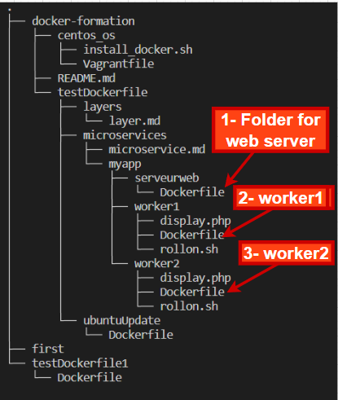
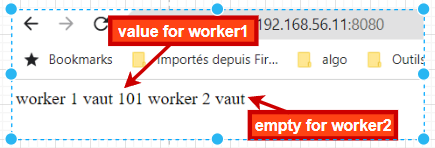
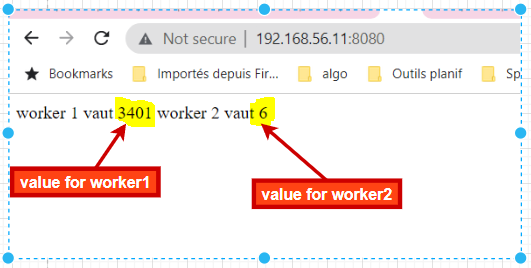

### Microservices principles and demo using Docker images

#### Microservices Interest : 

* split to better control the environment
	- network
	- version of services
	- ...

* split to adapt the resources
	example :
	- more workers : produce more
	- more web servers : receive  user requests
  - independently

* increase the speed of deployment

* reduce single point of failure (SPOF)

### Example :
We are going to implement the concept of microservice with docker images. it is a simple example for pedagogy, we must have : 
- a web page index.html that will display the information that are calculated in two other services
- two variables calculated in two different services.

__Node :__ 
With the box generator with vagrant, it is likely that you have the time that is not correct. Use this command to synchronize the time between your vagrant server and your local machine. This may cause the generation of docker images from the dockerfile to fail.

```sh
date
sudo date -s "2022-11-13 23:15:00"
date
```

#### Solution:
* 3 containers
	- 1 nginx web server (page display)
	- 2 php containers (workers) => 1 per variable

##### The Web Container

* Dockerfile
```
FROM ubuntu:latest
RUN apt-get update
RUN apt-get install -y nginx
VOLUME /var/www/html/
ENTRYPOINT ["nginx", "-g", "daemon off;"]
```

-------------------------------------------------

##### The workers

* Dockerfile

```
FROM php:7.2-cli
COPY rollon.sh /
COPY display.php /
RUN chmod 755 /rollon.sh
ENTRYPOINT ["./rollon.sh"]
```


-------------------------------------------------

###### Scripts rollon.sh 
This script is a PHP script, which allows to increment a variable of 100, then to save its value in a file called __worker1.txt__

```
#!/bin/bash
x=1
while true
do
echo $x > /var/www/html/worker1.txt
((x=x+100))
php /display.php
sleep 10
done
```

-------------------------------------------------

###### Script display.php
php script, which displays the values in each file written by each container worker

```
<?php
$file1='/var/www/html/worker1.txt';
$file2='/var/www/html/worker2.txt';
$Data1="";
$Data2="";

# worker1 data
if (file_exists($file1)) {
$fh = fopen($file1,'r');
while ($line = fgets($fh)) {
  $worker1 = $line;
}
fclose($fh);
}
```

-------------------------------------------------

```
# worker2 data
if (file_exists($file2)) {
$fh = fopen($file2,'r');
while ($line = fgets($fh)) {
  $worker2 = $line;
}
fclose($fh);
}

# display
$File = "/var/www/html/index.html";
$Handle = fopen($File, 'w');
$Data1 = "worker 1 is ".$worker1."\n";
fwrite($Handle, $Data1);
$Data2 = "worker 2 is ".$worker2."\n";
fwrite($Handle, $Data2);
fclose($Handle);
```

## execution and testing of our services

### Process : 
__Tree of the project__



* 1- web server container: 
	-  go to the directory __docker-formation/testDockerfile/microservices/myapp/serveurweb__
	- generate the docker image for the web server
    - start a web container calling the webserver, with this image. check in the browser that it displays __welcome nginx__

```sh
cd testDockerfile/microservices/myapp/serveurweb/
ls
docker build -t websvrimage:v1 .
doker images
docker run -tid --name webserver -p 8080:80 websvrimage:v1
docker ps
```

* 2- worker1 container: 
	-  go to the folder __docker-formation/testDockerfile/microservices/myapp/worker1__
	- generate an image of worker1
    - start a worker1 container, specify that it will use the volume created by the web server container
    - open the browser, refresh it and see that the worker1 service is already sending its data to the web server display page

```sh
cd ../worker1/
ls
docker build -t worker1image:v1 .
docker images
docker run -tid --name worker1 --volumes-from webserver worker1image:v1
docker ps
``` 
- open the browser and check :



 
 * 3- worker2 container: 
	-  go to the folder __docker-formation/testDockerfile/microservices/myapp/worker2__
	- generate an image of worker2 
    - start a worker2 container, specify that it will use the volume created by the web server container
    - open the browser, refresh it and notice that the worker2 service also sends its data to the web server display page. 

```sh
cd ../worker2/
ls
docker build -t worker2image:v1 .
docker images
docker run -tid --name worker2 --volumes-from webserver worker2image:v1
docker ps
```


The three microservices are working correctly.

### Note : 
In this conclusion, I come back to the notion of sharing volumes between containers, especially through __--volumes-from__.

### Some Bash Command
1. see the ip address of our webserver container
```sh
docker inspect -f "{{.NetworkSettings.IPAddress}}" webserver
```

2. See the Name and Ip Address of our Webserver container
```sh
docker inspect -f "{{.Name}}-->{{.NetworkSettings.IPAddress}}" webserver
```

3. display ip and all container name
```sh
for id in $(docker ps -aq); do docker inspect -f "{{.Name}}-->{{.NetworkSettings.IPAddress}}" $id; done
```